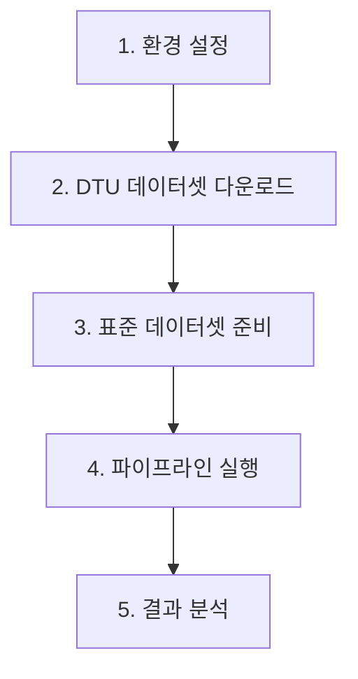

# 🚀 **VGGT-Gaussian Splatting 완전 실행 가이드 (H100 GPU)**

**처음부터 끝까지 한 번에!** - 환경 설치부터 P1-P5 파이프라인 실행까지

**Last Updated**: 2025-10-07 | **Validated on**: H100 80GB

---

## 📋 **전체 워크플로우 개요**



---

## 🔧 **1. 자동 환경 설정** (최초 1회, 약 20분 소요)

### **1.1 프로젝트 클론**
```bash
git clone https://github.com/Jihunkim95/vggt-gaussian-splatting-research.git
cd vggt-gaussian-splatting-research
```

### **1.2 자동 환경 설치 (H100 최적화)**
```bash
# One-command setup (모든 것을 자동으로 설치)
./setup_environment.sh
```

**이 스크립트가 자동으로 설치하는 것들:**
- ✅ **COLMAP 3.7** (127 packages, 166MB) - Structure-from-Motion
- ✅ **CUDA Toolkit 12.1** (~3GB) - fused-ssim 컴파일용
- ✅ **vggt_env** - VGGT 환경 (PyTorch 2.8.0, pycolmap 3.10.0)
- ✅ **gsplat_env** - gsplat 환경 (PyTorch 2.3.1, gsplat 1.5.3)
- ✅ **H100 환경변수** - TORCH_CUDA_ARCH_LIST=9.0

**예상 소요 시간**: 15-20분 (인터넷 속도에 따라 다름)

### **1.3 설치 확인**
```bash
# COLMAP 확인
colmap -h | head -5

# 환경 확인
ls env/
# 출력: vggt_env/  gsplat_env/  setup_h100.sh

# GPU 확인
nvidia-smi
```

---

## 📥 **2. DTU 데이터셋 다운로드**

### **2.1 DTU Rectified 다운로드**
```bash
# 데이터셋 디렉토리 생성
mkdir -p ./datasets/DTU/Rectified

cd ./datasets/DTU/Rectified

# scan1_train 다운로드 (Google Drive)
gdown --folder 1vLc3aajI8MujD8K7L1ImpWw3rLGR5qy8

# 또는 wget (DTU 공식)
# wget "http://roboimagedata2.compute.dtu.dk/data/MVS/Rectified.zip"
# unzip Rectified.zip
```

### **2.2 이미지 확인**
```bash
# scan1_train 이미지 수 확인
ls ./scan1_train/*.png | wc -l
# 출력: 343 (expected)

cd /data/vggt-gaussian-splatting-research
```

---

## 🎯 **3. 표준 데이터셋 준비** (H100 최적화)

### **3.1 DTU 각도별 정렬 샘플링**
```bash
# 343개 → 60개 균등 샘플링 + 각도별 정렬 (COLMAP 최적화)
./prepare_standard_dataset.sh ./datasets/DTU/Rectified/scan1_train
```

**출력 예시**:
```
🔧 표준 데이터셋 준비 중...
📊 원본 이미지: 343개
⚠️ 343개 > 60개 → 균등 샘플링 실행
   샘플링 간격: 매 5번째
   📷 DTU 데이터셋 감지 → 각도별 정렬 (COLMAP 최적화)
✅ 표준 데이터셋 준비 완료!
📸 최종 이미지 수: 60개
📁 출력: ./datasets/DTU/scan1_standard
```

**중요**: DTU 데이터셋은 각도별로 정렬됩니다 (0→1→2→3→4→5→6)
- COLMAP incremental SfM을 위한 최적화
- 연속적인 카메라 움직임 시뮬레이션

---

## 🚀 **4. 파이프라인 실행**

### **4.1 P1: COLMAP Baseline (가장 정확, 느림)**
```bash
# COLMAP SfM + gsplat (약 15-25분)
./run_pipeline.sh P1 ./datasets/DTU/scan1_standard
```

**특징**:
- 전통적인 COLMAP Structure-from-Motion
- 100% 카메라 등록 (각도 정렬 덕분)
- H100: ~2.5GB VRAM, 15-25분 소요

### **4.2 P5: VGGT + BA + gsplat (최고 품질)**
```bash
# VGGT + Bundle Adjustment + gsplat (약 13분)
./run_pipeline.sh P5 ./datasets/DTU/scan1_standard
```

**특징**:
- VGGT로 초기 재구성 (3.5분)
- Bundle Adjustment 최적화
- gsplat 훈련 (30K steps)
- H100: ~20GB VRAM, 13분 소요
- PSNR: ~16, SSIM: ~0.74

### **4.3 병렬 실행 (권장)**
```bash
# 여러 파이프라인 동시 실행 (H100 80GB VRAM 활용)
./run_pipeline.sh P1 ./datasets/DTU/scan1_standard &
./run_pipeline.sh P5 ./datasets/DTU/scan1_standard &

# 진행 상황 모니터링
tail -f /tmp/p1_*.log
tail -f /tmp/p5_*.log

# 백그라운드 작업 확인
jobs
```

---

## 📊 **5. 결과 확인 및 분석**

### **5.1 결과 디렉토리 구조**
```
./results/
├── P1_scan1_20251007_123456/          # COLMAP + gsplat
│   ├── ckpts/ckpt_*.pt               # 체크포인트 (7K, 15K, 30K)
│   ├── ply/point_cloud_*.ply         # PLY 파일
│   ├── renders/val_step*.png         # 렌더링 이미지
│   ├── stats/val_step*.json          # 성능 메트릭
│   └── metadata.json                 # 실행 정보
└── P5_scan1_20251007_123457/          # VGGT + BA + gsplat
    ├── vggt_ba_sparse/               # VGGT 초기 재구성
    ├── ckpts/                        # gsplat 체크포인트
    ├── ply/                          # 3D 포인트 클라우드
    └── stats/val_step29999.json      # 최종 메트릭
```

### **5.2 결과 분석**
```bash
# P1 결과 확인
cat ./results/P1_scan1_*/stats/val_step29999.json
# PSNR, SSIM, LPIPS 확인

# P5 결과 확인
cat ./results/P5_scan1_*/stats/val_step29999.json

# PLY 파일 확인
ls -lh ./results/*/ply/*.ply
```

### **5.3 예상 결과 (DTU scan1)**

| 파이프라인 | 시간 (H100) | VRAM | Gaussians | PSNR | SSIM | 특징 |
|-----------|------------|------|-----------|------|------|------|
| **P1** | 15-25분 | ~2.5GB | ~1.5M | TBD | TBD | 전통 COLMAP |
| **P5** | 13분 | ~20GB | ~1.5M | ~16 | ~0.74 | VGGT+BA |

---

## 🔬 **6. CO3Dv2 데이터셋 (추가 실험)**

### **6.1 CO3Dv2 준비**
```bash
# CO3Dv2 apple 다운로드
mkdir -p ./datasets/CO3Dv2/apple/110_13051_23361/images
# [이미지를 다운로드하여 images/ 폴더에 배치]

# 표준화 (JPG 자동 감지)
./prepare_standard_dataset.sh ./datasets/CO3Dv2/apple/110_13051_23361/images
```

### **6.2 CO3Dv2에서 P1 실행**
```bash
# 비디오 프레임 → COLMAP 완벽 호환
./run_pipeline.sh P1 ./datasets/CO3Dv2/apple_110_13051_23361_standard
```

**결과 (검증 완료)**:
- ✅ 80/80 cameras 등록 (100%)
- ✅ 13.8분 소요 (H100)
- ✅ COLMAP: 582초, gsplat: 243초

---

## 🛠️ **문제 해결**

### **일반적인 문제**

**Q: "colmap: not found" 에러**
```bash
# A: setup_environment.sh 재실행 또는 수동 설치
sudo apt-get install -y colmap
```

**Q: "CUDA error: no kernel image available"**
```bash
# A: H100 환경변수 설정
source env/setup_h100.sh

# 또는 수동 설정
export TORCH_CUDA_ARCH_LIST="9.0"
export CUDA_HOME=/opt/cuda-12.1
```

**Q: "fused-ssim compilation failed"**
```bash
# A: CUDA Toolkit 12.1 설치 확인
ls /opt/cuda-12.1/bin/nvcc

# 재설치
source env/gsplat_env/bin/activate
pip install --no-build-isolation "git+https://github.com/rahul-goel/fused-ssim@328dc9836f513d00c4b5bc38fe30478b4435cbb5"
```

**Q: "ImportError: libGL.so.1"**
```bash
# A: opencv-python-headless 사용 (이미 setup_environment.sh에 포함)
pip uninstall opencv-python
pip install opencv-python-headless==4.12.0.88
```

**Q: DTU에서 COLMAP 카메라 등록 실패**
```bash
# A: 각도 정렬 확인
ls ./datasets/DTU/scan1_standard/images/ | head -10
# 출력: 001_rect_*_0_r5000.png, 002_rect_*_0_r5000.png, ...
# (각도 0부터 시작하는지 확인)

# 재준비
rm -rf ./datasets/DTU/scan1_standard
./prepare_standard_dataset.sh ./datasets/DTU/Rectified/scan1_train
```

---

## 📚 **참고 문서**

### **워크플로우 문서**
- **20251007_VGGT-GSplat_WorkFlow.md** - P1 구현 및 DTU 각도 정렬
- **20251006_VGGT-GSplat_WorkFlow.md** - H100 호환성 해결

### **가이드 문서**
- **PIPELINE_EXECUTION_GUIDE.md** - 파이프라인별 상세 설명
- **Compatible_Environment_Guide.md** - 환경 호환성 가이드

### **핵심 스크립트**
- **setup_environment.sh** - 자동 환경 설정
- **run_pipeline.sh** - 통합 파이프라인 실행기
- **prepare_standard_dataset.sh** - 데이터셋 표준화

---

## ⏱️ **예상 소요 시간 (H100 GPU)**

| 단계 | 소요 시간 | 설명 |
|------|-----------|------|
| **환경 설정** | 15-20분 | 최초 1회만 (COLMAP, CUDA, 가상환경) |
| **DTU 다운로드** | 5-10분 | Google Drive gdown |
| **데이터셋 준비** | 1-2분 | 60개 샘플링 + 각도 정렬 |
| **P1 실행** | 15-25분 | COLMAP + gsplat 30K |
| **P5 실행** | 13분 | VGGT + BA + gsplat 30K |

**총 소요시간 (처음 사용자)**: 약 45-60분

---

## 🎯 **성공 확인**

실행 완료 후 다음 명령어로 성공 확인:

```bash
# 1. 결과 파일 확인
ls ./results/P*/ply/*.ply

# 2. 성능 메트릭 확인
cat ./results/P5_scan1_*/stats/val_step29999.json | grep -E "psnr|ssim|lpips"

# 3. 타이밍 정보 확인
cat ./results/P*/metadata.json | grep "elapsed_time"

# 4. PLY 파일 크기 확인
du -sh ./results/P*/ply/
```

**성공 기준**:
- ✅ PLY 파일이 3개 생성됨 (7K, 15K, 30K steps)
- ✅ val_step29999.json에 PSNR/SSIM/LPIPS 값 존재
- ✅ 렌더링 이미지 생성됨 (renders/*.png)

---

## 🌟 **다음 단계**

### **추가 실험**
1. **다른 DTU 스캔 시도**
   ```bash
   # scan18, scan24, scan37 등
   ./prepare_standard_dataset.sh ./datasets/DTU/Rectified/scan18_train
   ./run_pipeline.sh P5 ./datasets/DTU/scan18_standard
   ```

2. **파이프라인 비교**
   ```bash
   # P1 vs P5 정량적 비교
   python scripts/compare_pipelines.py \
       --p1 ./results/P1_scan1_* \
       --p5 ./results/P5_scan1_*
   ```

3. **커스텀 데이터셋**
   ```bash
   # 직접 촬영한 이미지로 실험
   ./prepare_standard_dataset.sh /path/to/your/images
   ./run_pipeline.sh P5 ./datasets/your_dataset_standard
   ```

---

**🎉 축하합니다! VGGT-Gaussian Splatting 파이프라인 실행 완료!**

**Last Updated**: 2025-10-07
**Validated Environment**: H100 80GB + CUDA 12.1 + Ubuntu 22.04
