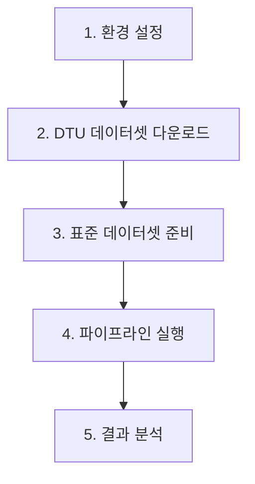

# 🚀 **VGGT-Gaussian Splatting 완전 실행 가이드**

**처음부터 끝까지 한 번에!** - DTU 다운로드부터 P1-P5 파이프라인 실행까지

---

## 📋 **전체 워크플로우 개요**



---

## 🔧 **1. 환경 설정** (최초 1회)

### **1.1 프로젝트 클론**
```bash
git clone https://github.com/Jihunkim95/vggt-gaussian-splatting-research.git
cd vggt-gaussian-splatting-research
```

### **1.2 가상환경 생성**
```bash
# VGGT 환경 생성
python -m venv ./env/vggt_env
source ./env/vggt_env/bin/activate

# 패키지 설치
pip install -r requirements_vggt_env.txt

# LightGlue 별도 설치
pip install git+https://github.com/cvg/LightGlue.git
```

### **1.3 gsplat 환경 생성** (P1용)
```bash
python -m venv ./env/gsplat_env
source ./env/gsplat_env/bin/activate
pip install gsplat torch torchvision
```

---

## 📥 **2. DTU 데이터셋 다운로드**

### **2.1 SampleSet 다운로드** (6.3GB)
```bash
# 데이터셋 디렉토리 생성
mkdir -p ./datasets/DTU

# DTU SampleSet 다운로드
cd ./datasets/DTU
wget -c "http://roboimagedata2.compute.dtu.dk/data/MVS/SampleSet.zip"

# 압축 해제
unzip SampleSet.zip

# 확인
ls SampleSet/MVS\ Data/Cleaned/
# 출력: scan1  scan6
```

### **2.2 이미지 확인**
```bash
# scan1 이미지 수 확인 (392개 있어야 함)
ls ./SampleSet/MVS\ Data/Cleaned/scan1/ | wc -l
```

---

## 🎯 **3. 표준 데이터셋 준비** (RTX 6000 Ada 최적화)

### **3.1 60개 이미지 샘플링**
```bash
# 프로젝트 루트로 돌아가기
cd /data/vggt-gaussian-splatting-research

# 표준 데이터셋 준비 (392개 → 60개 균등 샘플링)
./prepare_standard_dataset.sh "./datasets/DTU/SampleSet/MVS Data/Cleaned/scan1/images"
```

**출력 예시**:
```
🔧 표준 데이터셋 준비 중...
📊 원본 이미지: 392개
⚠️ 392개 > 60개 → 균등 샘플링 실행
   샘플링 간격: 매 6번째
✅ 표준 데이터셋 준비 완료!
📸 최종 이미지 수: 60개
```

---

## 🚀 **4. 파이프라인 실행**

### **4.1 P2: VGGT Feed-Forward (가장 빠름)**
```bash
# P2 실행 (약 80초)
./run_pipeline.sh P2
```

### **4.2 P3: VGGT + Bundle Adjustment**
```bash
# P3 실행 (약 15분)
./run_pipeline.sh P3
```

### **4.3 P1: COLMAP + gsplat (가장 오래 걸림)**
```bash
# P1 실행 (약 47분)
./run_pipeline.sh P1
```

### **4.4 동시 실행** (권장)
```bash
# 백그라운드에서 동시 실행
./run_pipeline.sh P2 &
./run_pipeline.sh P3 &
./run_pipeline.sh P1 &

# 진행 상황 확인
jobs
```

---

## 📊 **5. 결과 확인 및 분석**

### **5.1 결과 디렉토리 구조**
```
./results/
├── P1_20250917_123456/          # COLMAP + gsplat
├── P2_20250917_123457/          # VGGT Feed-Forward
└── P3_20250917_123458/          # VGGT + Bundle Adjustment
```

### **5.2 결과 분석**
```bash
# 모든 결과 요약
for result_dir in ./results/P*; do
    echo "=== $(basename $result_dir) ==="
    cat "$result_dir/analysis.json"
    echo ""
done
```

### **5.3 예상 결과**
| 파이프라인 | 시간 | 3D 포인트 | PLY 크기 | 특징 |
|-----------|------|-----------|----------|------|
| **P2** | ~80초 | 100,000개 | 1.5MB | 가장 빠름 |
| **P3** | ~15분 | 40,000개 | TBD | 고품질 |
| **P1** | ~47분 | 568,000개 | 8.7MB | 기준선 |

---

## 🛠️ **문제 해결**

### **일반적인 문제**

**Q: pycolmap 에러 발생**
```bash
# A: 정확한 버전 설치
pip install pycolmap==3.10.0
```

**Q: CUDA 메모리 부족**
```bash
# A: 이미지 수 줄이기 (60개 → 30개)
./sample_images.sh "source_dir" "target_dir" 30
```

**Q: 환경 전환 문제**
```bash
# A: 수동 환경 전환
source ./env/vggt_env/bin/activate  # P2, P3용
source ./env/gsplat_env/bin/activate  # P1용
```

---

## 📚 **참고 문서**

- **상세 실행 가이드**: `PIPELINE_EXECUTION_GUIDE.md`
- **환경 설정**: `requirements_vggt_env.txt`
- **연구 배경**: `docs/workflows/20250912_VGGT-GSplat_WorkFlow.md`
- **최적화 전략**: `20250903 FixVGGT-Gaussian Splatting Pipeline.md`

---

## ⏱️ **예상 소요 시간**

| 단계 | 소요 시간 | 설명 |
|------|-----------|------|
| 환경 설정 | 30분 | 최초 1회만 |
| DTU 다운로드 | 20분 | 인터넷 속도에 따라 |
| 표준 데이터셋 준비 | 2분 | 이미지 복사 |
| P2 실행 | 80초 | 가장 빠름 |
| P3 실행 | 15분 | 중간 |
| P1 실행 | 47분 | 가장 오래 |

**총 소요시간**: 약 2시간 (동시 실행 시 1.5시간)

---

## 🎯 **성공 확인**

실행 완료 후 다음이 있으면 성공:
```bash
ls ./results/P*/analysis.json  # 분석 파일들
ls ./results/P*/sparse/points.ply  # PLY 결과 파일들
```

---

**🎉 축하합니다! VGGT-Gaussian Splatting 파이프라인 실행 완료!**