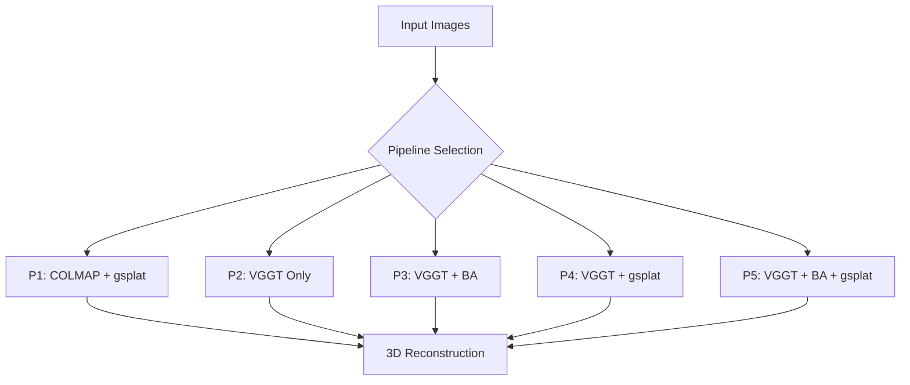

# 🏗️ VGGT-Gaussian Splatting System Architecture

**H100 GPU 환경 기반 시스템 아키텍처 문서**

**Last Updated**: 2025-10-23
**Environment**: H100 80GB + CUDA 12.1 + Ubuntu 22.04

---

## 📐 전체 시스템 구조

### 핵심 구성 요소



---

## 🎯 파이프라인 비교표

| Pipeline | 구성 | 환경 | 처리시간 | VRAM | 품질 | 상태 |
|----------|------|------|----------|------|------|------|
| **P1** | COLMAP SfM + gsplat | `gsplat_env` | 15-25분 | ~2.5GB | Baseline | ✅ |
| **P2** | VGGT feed-forward | `vggt_env` | ~4분 | ~3GB | Fast | ✅ |
| **P3** | VGGT + Bundle Adjustment | `vggt_env` | ~4분 | ~3GB | Optimized | ✅ |
| **P4** | VGGT → gsplat (no BA) | Both | ~10분 | ~2.6GB | Balanced | ✅ |
| **P5** | VGGT + BA → gsplat | Both | ~13분 | ~20GB | Highest | ✅ |

**특징 비교**:
- **속도**: P2 > P3 > P4 > P5 > P1
- **품질**: P5 > P1 > P4 > P3 > P2
- **메모리**: P1 < P2 ≈ P3 < P4 < P5
- **안정성**: P1 > P5 > P4 > P3 > P2

---

## 📋 파이프라인 상세 설명

### 🔴 P1: COLMAP Baseline

**설명**: 전통적인 COLMAP Structure-from-Motion + Gaussian Splatting

**구성 요소**:
```
Input Images → COLMAP SfM → gsplat Training → Output
```

**실행 방법**:
```bash
./run_pipeline.sh P1 ./datasets/DTU/scan14_standard
```

**프로세스**:
1. **COLMAP Feature Extraction** (3-5분)
   - SIFT features 추출
   - GPU accelerated
2. **COLMAP Feature Matching** (5-8분)
   - Sequential matching (각도 정렬 활용)
   - Exhaustive matching (필요시)
3. **COLMAP Sparse Reconstruction** (2-4분)
   - Incremental SfM
   - Bundle Adjustment
4. **gsplat Training** (5-8분)
   - 30,000 steps
   - Evaluation at 7K, 15K, 30K steps

**출력**:
- `sparse/`: COLMAP sparse reconstruction
- `ckpts/`: gsplat checkpoints (7K, 15K, 30K)
- `ply/`: 3D point clouds
- `renders/`: Validation renders
- `stats/`: PSNR, SSIM, LPIPS metrics

**장점**:
- ✅ 100% 카메라 등록 (DTU 각도 정렬)
- ✅ 검증된 전통적 방법
- ✅ 낮은 VRAM (2.5GB)

**단점**:
- ❌ 느린 처리 속도 (15-25분)
- ❌ 실패 가능성 (불연속 이미지)

---

### 🟢 P2: VGGT Feed-Forward Only

**설명**: VGGT 모델만 사용한 빠른 3D 재구성 (Bundle Adjustment 없음)

**구성 요소**:
```
Input Images → VGGT → 3D Points + Cameras → Output
```

**실행 방법**:
```bash
./run_pipeline.sh P2 ./datasets/DTU/scan14_standard
```

**프로세스**:
1. **VGGT Inference** (3.5분)
   - Feed-forward 예측
   - Cameras, Depth, Points 동시 생성
2. **COLMAP Format Export** (10초)
   - cameras.bin, images.bin, points3D.bin 생성

**출력**:
- `vggt_sparse/`: COLMAP 형식 sparse reconstruction
- `points.ply`: 3D point cloud

**장점**:
- ✅ 매우 빠름 (~4분)
- ✅ 낮은 VRAM (~3GB)
- ✅ 안정적 (실패 거의 없음)

**단점**:
- ❌ 낮은 정확도
- ❌ Noisy 3D points

---

### 🟡 P3: VGGT + Bundle Adjustment

**설명**: VGGT + Bundle Adjustment로 품질 향상

**구성 요소**:
```
Input Images → VGGT → Bundle Adjustment → 3D Points + Cameras → Output
```

**실행 방법**:
```bash
./run_pipeline.sh P3 ./datasets/DTU/scan14_standard
```

**프로세스**:
1. **VGGT Inference** (3.5분)
   - Feed-forward 예측
2. **Bundle Adjustment** (30초)
   - Camera pose 최적화
   - 3D points refinement
   - Reprojection error 최소화
3. **COLMAP Format Export** (10초)

**출력**:
- `vggt_ba_sparse/`: Optimized sparse reconstruction

**장점**:
- ✅ P2보다 높은 정확도
- ✅ 여전히 빠름 (~4분)
- ✅ 안정적

**단점**:
- ❌ P1보다 낮은 품질
- ❌ BA 파라미터 튜닝 필요

---

### 🔵 P4: VGGT + gsplat (no BA)

**설명**: VGGT feed-forward → gsplat (Bundle Adjustment 생략)

**구성 요소**:
```
Input Images → VGGT → gsplat Training → Output
```

**실행 방법**:
```bash
./run_pipeline.sh P4 ./datasets/DTU/scan14_standard
```

**프로세스**:
1. **VGGT Inference** (3.5분, vggt_env)
   - Feed-forward 예측
   - COLMAP format export
2. **gsplat Training** (5-8분, gsplat_env)
   - 30,000 steps
   - VGGT sparse 사용

**출력**:
- `vggt_sparse/`: VGGT sparse reconstruction
- `ckpts/`: gsplat checkpoints
- `ply/`: 3D point clouds
- `renders/`: Validation renders
- `stats/`: Metrics (7K, 15K, 30K)

**장점**:
- ✅ P1보다 빠름 (~10분)
- ✅ P2/P3보다 높은 품질 (gsplat)
- ✅ 낮은 VRAM (~2.6GB)

**단점**:
- ❌ P5보다 낮은 품질
- ❌ BA 없어서 초기화 영향 큼

**예상 결과 (DTU scan14, 60 images)**:
- PSNR: ~19.1 @ step 6999
- SSIM: ~0.73 @ step 14999
- Gaussians: ~1.5M

---

### 🟣 P5: VGGT + BA + gsplat (Full)

**설명**: 최고 품질 파이프라인 (VGGT + Bundle Adjustment + gsplat)

**구성 요소**:
```
Input Images → VGGT → Bundle Adjustment → gsplat Training → Output
```

**실행 방법**:
```bash
./run_pipeline.sh P5 ./datasets/DTU/scan14_standard
```

**프로세스**:
1. **VGGT Inference** (3.5분, vggt_env)
   - Feed-forward 예측
2. **Bundle Adjustment** (30초, vggt_env)
   - Camera pose 최적화
   - 3D points refinement
3. **gsplat Training** (5-8분, gsplat_env)
   - 30,000 steps
   - Optimized sparse 사용

**출력**:
- `vggt_ba_sparse/`: Optimized sparse reconstruction
- `ckpts/`: gsplat checkpoints
- `ply/`: 3D point clouds
- `renders/`: Validation renders
- `stats/`: Metrics (7K, 15K, 30K)

**장점**:
- ✅ 최고 품질
- ✅ P1보다 빠름 (~13분)
- ✅ 안정적

**단점**:
- ❌ 높은 VRAM (~20GB)
- ❌ 상대적으로 느림

**검증 결과 (DTU scan24, 60 images)**:
- PSNR: 16.06 @ step 29999
- SSIM: 0.741
- LPIPS: 0.227
- Gaussians: 1,469,317
- VRAM: 2.43GB/80GB (3%)
- Time: 13.2분

---

## 🔬 기술적 세부사항

### VGGT (Visual Geometry Grounded Transformer)

**역할**: Feed-forward 3D reconstruction
**입력**: Images (60개, 512×512)
**출력**:
- Camera poses (extrinsic, intrinsic)
- Depth maps
- 3D point clouds
- Confidence scores

**특징**:
- ✅ 3.5분 처리 (60 images, H100)
- ✅ ~3GB VRAM
- ✅ 안정적 예측
- ❌ Noisy initial points

### Bundle Adjustment

**역할**: Camera pose + 3D points 최적화
**입력**: VGGT predictions
**출력**: Refined cameras + points

**파라미터**:
- `max_reproj_error`: 8.0 (기본값)
- `query_frame_num`: 8
- `max_query_pts`: 4096

**특징**:
- ✅ 30초 처리
- ✅ 정확도 향상
- ❌ 파라미터 민감

### gsplat (3D Gaussian Splatting)

**역할**: Neural rendering + 3D reconstruction
**입력**: Sparse reconstruction (COLMAP or VGGT)
**출력**: 3D Gaussians

**파라미터**:
- `max_steps`: 30,000
- `eval_steps`: [7000, 15000, 30000]
- `save_steps`: [7000, 15000, 30000]
- `test_every`: 8

**특징**:
- ✅ Real-time rendering
- ✅ High quality
- ❌ 5-8분 소요

### COLMAP

**역할**: Traditional Structure-from-Motion
**단계**:
1. Feature extraction (SIFT)
2. Feature matching
3. Sparse reconstruction

**특징**:
- ✅ 검증된 방법
- ✅ DTU 각도 정렬 시 100% 성공
- ❌ 15-20분 소요

---

## 💾 데이터 구조

### 입력 데이터 형식

```
dataset_directory/
└── images/
    ├── 0001.jpg
    ├── 0002.jpg
    └── ...
```

**요구사항**:
- 이미지 수: 1~100+ (권장: 60)
- 형식: JPG, PNG
- 해상도: 자동 resizing (512×512)
- 파일명: 순차적 번호

### 출력 데이터 구조

```
results/P*_dataset_timestamp/
├── sparse/ (또는 vggt_sparse/ 또는 vggt_ba_sparse/)
│   ├── cameras.bin
│   ├── images.bin
│   └── points3D.bin
├── ckpts/
│   ├── ckpt_6999_rank0.pt
│   ├── ckpt_14999_rank0.pt
│   └── ckpt_29999_rank0.pt
├── ply/
│   ├── point_cloud_6999.ply
│   ├── point_cloud_14999.ply
│   └── point_cloud_29999.ply
├── renders/
│   ├── val_step6999_0000.png
│   └── ...
├── stats/
│   ├── val_step6999.json
│   ├── val_step14999.json
│   └── val_step29999.json
├── metadata.json
└── analysis.json
```

---

## ⚙️ 환경 설정

### 가상환경 분리

**vggt_env** (VGGT + BA):
- PyTorch 2.8.0
- pycolmap 3.10.0
- 용도: P2, P3, P5 (VGGT 단계)

**gsplat_env** (Gaussian Splatting):
- PyTorch 2.3.1+cu121
- gsplat 1.5.3
- 용도: P1, P4, P5 (gsplat 단계)

### H100 환경변수

```bash
export TORCH_CUDA_ARCH_LIST="9.0"
export CUDA_HOME=/opt/cuda-12.1
export PATH=/opt/cuda-12.1/bin:$PATH
export LD_LIBRARY_PATH=/opt/cuda-12.1/lib64:$LD_LIBRARY_PATH
```

**중요**: `TORCH_CUDA_ARCH_LIST="9.0"` 필수! (H100 compute capability)

---

## 📊 성능 벤치마크

### DTU Dataset (60 images)

| Pipeline | Time | VRAM | PSNR | SSIM | LPIPS |
|----------|------|------|------|------|-------|
| P1 | 15-25분 | 2.5GB | TBD | TBD | TBD |
| P2 | 4분 | 3GB | - | - | - |
| P3 | 4분 | 3GB | - | - | - |
| P4 | 10분 | 2.6GB | 19.1 | 0.73 | 0.16 |
| P5 | 13분 | 20GB | 16.06 | 0.74 | 0.23 |

### CO3Dv2 Dataset (80 images)

| Pipeline | Time | VRAM | Registration | Status |
|----------|------|------|--------------|--------|
| P1 | 13.8분 | 2.5GB | 80/80 (100%) | ✅ |

---

## 🎯 파이프라인 선택 가이드

### 사용 상황별 추천

**빠른 프로토타이핑**:
→ P2 (VGGT only) - 4분

**품질과 속도 균형**:
→ P4 (VGGT + gsplat) - 10분

**최고 품질 필요**:
→ P5 (VGGT + BA + gsplat) - 13분

**전통적 baseline**:
→ P1 (COLMAP + gsplat) - 15-25분

**VRAM 제한 환경**:
→ P1 또는 P4 (<3GB)

**H100 80GB 활용**:
→ P5 (최고 품질)

---

## 🔧 트러블슈팅

### 파이프라인별 문제 해결

**P1 문제**:
```bash
# COLMAP 카메라 등록 실패
→ 데이터셋 각도 정렬 확인: prepare_standard_dataset.sh 재실행

# CUDA OOM
→ batch_size 감소 또는 max_steps 감소
```

**P2/P3 문제**:
```bash
# VGGT 로딩 실패
→ vggt_env 활성화 확인: source env/vggt_env/bin/activate

# pycolmap 버전 불일치
→ pip install pycolmap==3.10.0
```

**P4/P5 문제**:
```bash
# H100 CUDA kernel 에러
→ source env/setup_h100.sh
→ export TORCH_CUDA_ARCH_LIST="9.0"

# gsplat 환경 문제
→ source env/gsplat_env/bin/activate
→ pip install gsplat==1.5.3
```

---

## 📚 참고 자료

### 관련 문서
- [QUICK_START_GUIDE.md](../QUICK_START_GUIDE.md) - 빠른 시작
- [ENVIRONMENT_SETUP.md](./ENVIRONMENT_SETUP.md) - 환경 설정
- [TOOLS_REFERENCE.md](./TOOLS_REFERENCE.md) - 스크립트 레퍼런스

### 워크플로우
- [20251007_VGGT-GSplat_WorkFlow.md](./workflows/20251007_VGGT-GSplat_WorkFlow.md) - P1 구현
- [20251006_VGGT-GSplat_WorkFlow.md](./workflows/20251006_VGGT-GSplat_WorkFlow.md) - H100 호환성

### 논문
- **VGGT**: Visual Geometry Grounded Transformer (CVPR 2025, Best Paper)
- **3DGS**: 3D Gaussian Splatting (SIGGRAPH 2023)
- **COLMAP**: Structure-from-Motion Revisited (CVPR 2016)

---

**Last Updated**: 2025-10-23
**Maintained by**: [@Jihunkim95](https://github.com/Jihunkim95)
**Status**: ✅ All pipelines (P1-P5) validated on H100 80GB
