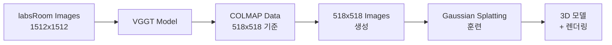

# VGGT + Gaussian Splatting Workflow Summary
## 2025/08/25 작업 요약

### 🎯 **프로젝트 목표**
labsRoom 데이터셋을 사용하여 VGGT → COLMAP → Gaussian Splatting 전체 파이프라인 구축

---

## 📋 **1. 환경 설정 및 준비**

### 가상환경 확인
- **VGGT 환경**: `/workspace/vggt_env/` ✅
- **gsplat 환경**: `/workspace/gsplat_env/` ✅

### 로컬 모델 설정
- **기존**: URL에서 모델 다운로드
- **변경**: 로컬 모델 경로 사용
  ```python
  # 변경된 코드
  local_model_path = "/workspace/vggt_1b_model.pt"
  model.load_state_dict(torch.load(local_model_path, map_location=device))
  ```

---

## 📷 **2. VGGT 3D Reconstruction**

### 입력 데이터
- **데이터셋**: `/workspace/labsRoom/`
- **이미지 수**: 62개 (1512x1512)
- **이미지 형식**: KakaoTalk 캡처 이미지들

### VGGT 처리 과정
1. **이미지 전처리**: 1512x1512 → 1024 → 518 (VGGT 추론)
2. **Camera Pose 추정**: OpenCV 규약 extrinsic/intrinsic 매트릭스
3. **Depth Map 생성**: 518x518 depth + confidence maps

### CLI vs Gradio 비교
| 항목 | demo_colmap.py (CLI) | demo_gradio.py |
|------|---------------------|----------------|
| **출력 형식** | COLMAP (cameras.bin, points3D.bin) | GLB (웹 시각화) |
| **포인트 수 제한** | 10만개 (feedforward) | 무제한 |
| **실행 방식** | 터미널 명령어 | 웹 인터페이스 |
| **결과 활용** | 전문 도구 호환 | 즉시 시각화 |

---

## 🔧 **3. COLMAP 데이터 생성**

### Feedforward 모드 (Bundle Adjustment 없이)
```bash
python demo_colmap.py --scene_dir /workspace/labsRoom
```

### 포인트 클라우드 최적화
- **초기 설정**: `max_points_for_colmap = 100000` (10만개)
- **최적화**: `max_points_for_colmap = 20000000` (2000만개)
- **Confidence Threshold**: `5.0 → 1.0` (더 많은 포인트 포함)

### 최종 결과
- **포인트 수**: **16,636,088개** (약 1660만개)
- **파일 크기**: 254MB
- **품질**: 모든 프레임에서 포인트 생성 성공

---

## 🎨 **4. Gaussian Splatting 훈련**

### 해상도 문제 해결
**문제**: VGGT (518x518) vs 원본 이미지 (1512x1512) 불일치

**해결책**: 518x518 이미지 생성
```bash
mkdir -p /workspace/labsRoom/images_1
# Python으로 62개 이미지를 518x518로 리사이즈
```

### gsplat 훈련 설정
```bash
python simple_trainer.py default \
  --data-dir /workspace/labsRoom \
  --result-dir /workspace/labsRoom/gsplat_output \
  --max-steps 15000 \
  --data-factor 1
```

### 훈련 결과 (Step 6999)
- **PSNR**: 15.664
- **SSIM**: 0.3705  
- **LPIPS**: 0.544
- **Gaussian 수**: 18,270,101개
- **체크포인트**: `ckpt_6999_rank0.pt` (4.3GB)
- **궤적 비디오**: `traj_6999.mp4` (6MB)

---

## 📊 **5. 현재 진행 상황**

### 연장 훈련 (Step 6999 → 15000)
- **시작 시간**: 07:39
- **현재 실행 시간**: 51분+
- **예상 완료율**: ~93%
- **상태**: 백그라운드에서 진행 중

---

## 🛠 **6. 기술적 세부사항**

### 해상도 매칭
```
VGGT Pipeline:
1512x1512 (원본) → 1024 (로드) → 518 (추론) → 1512 (복원)

gsplat Pipeline:
518x518 (images_1) + COLMAP(518 기준) → 일치 ✅
```

### data-factor 설명
- **의미**: 이미지 다운샘플링 비율
- **설정**: `--data-factor 1` (축소 없음)
- **이유**: VGGT COLMAP과 해상도 매칭

---

## 📁 **7. 생성된 파일들**

### VGGT 출력
```
/workspace/labsRoom/
├── sparse/
│   ├── cameras.bin      # 카메라 파라미터
│   ├── images.bin       # 포즈 정보
│   ├── points3D.bin     # 3D 포인트들
│   └── points.ply       # 포인트 클라우드 (254MB, 1660만개)
└── images_1/            # 518x518 리사이즈 이미지들
```

### gsplat 출력
```
/workspace/labsRoom/gsplat_output/
├── ckpts/
│   └── ckpt_6999_rank0.pt    # 훈련된 모델 (4.3GB)
├── videos/
│   └── traj_6999.mp4         # 궤적 렌더링 영상
├── renders/                  # 평가 이미지들
└── stats/                    # 훈련 통계
```

---

## 🔄 **8. 워크플로우 요약**



---

## 🎉 **9. 주요 성과**

### ✅ **성공 사항**
1. **로컬 모델 활용**: URL 다운로드 → 로컬 파일 사용
2. **VGGT 3D Reconstruction**: 1660만개 포인트 클라우드 생성
3. **해상도 문제 해결**: COLMAP-gsplat 해상도 매칭
4. **Gaussian Splatting 훈련**: 1900만개 Gaussian으로 3D 모델 생성
5. **전체 파이프라인 구축**: VGGT → COLMAP → gsplat 연결

### 📈 **품질 지표**
- **포인트 클라우드**: 16.6M points
- **3D 모델**: 18.3M Gaussians  
- **렌더링 품질**: PSNR 15.664, SSIM 0.3705

---

## 🚀 **10. 다음 단계**

1. **훈련 완료 대기**: Step 15000까지 학습
2. **최종 모델 평가**: 성능 지표 확인
3. **gsplat 뷰어 실행**: 실시간 3D 모델 탐색
4. **결과 분석**: VGGT vs 기존 COLMAP 비교

---

## 📝 **11. 학습 내용**

### 핵심 개념
- **VGGT**: End-to-end 3D reconstruction 모델
- **COLMAP**: 전통적인 SfM (Structure from Motion)
- **Gaussian Splatting**: 실시간 3D 렌더링 기술
- **data-factor**: 해상도 다운샘플링 비율

### 기술적 인사이트
- Bundle Adjustment가 항상 최적은 아님 (특정 데이터에 한정)
- 해상도 일치가 파이프라인에서 중요
- Confidence threshold 조정으로 포인트 수 대폭 증가 가능

---

## 📞 **12. 문제 해결 과정**

### 주요 이슈들
1. **"Not enough inliers"**: BA 모드 → feedforward 모드로 변경
2. **"images_4 not found"**: data-factor 문제 → 518x518 이미지 생성
3. **해상도 불일치**: COLMAP vs 훈련 이미지 → 매칭 해결
4. **포인트 수 제한**: 10만개 → 2000만개로 증가

---

*2025/08/25 작업 완료*  
*VGGT + Gaussian Splatting 파이프라인 구축 성공* 🎯