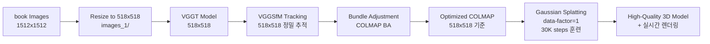

# VGGT + Gaussian Splatting Workflow Summary
## 2025/08/27 업데이트

### 🎯 **프로젝트 목표**
VGGT + Bundle Adjustment → COLMAP → Gaussian Splatting 고품질 파이프라인 구축

---

## 📋 **1. 환경 설정 및 준비**

### 가상환경 확인
- **VGGT 환경**: `/workspace/vggt_env/` ✅
- **gsplat 환경**: `/workspace/gsplat_env/` ✅

### 로컬 모델 설정
```python
# VGGT 모델 로드 (demo_colmap.py:115-126)
local_model_path = "/workspace/vggt_1b_model.pt"
if not os.path.exists(local_model_path):
    local_model_path = "/workspace/vggt_1b_commercial_model.pt"

model.load_state_dict(torch.load(local_model_path, map_location=device))
```

---

## 📷 **2. VGGT + Bundle Adjustment 파이프라인**

### 핵심 파이프라인 코드
- **메인 스크립트**: `/workspace/vggt/demo_colmap.py`
- **훈련 스크립트**: `/workspace/gsplat/examples/simple_trainer.py`

### VGGT+BA vs Feedforward 모드 비교

| 모드 | VGGT+BA (`--use_ba`) | Feedforward (기본) |
|------|---------------------|-------------------|
| **트래킹** | VGGSfM 정밀 추적 | 픽셀 기반 매핑 |
| **최적화** | Bundle Adjustment | 직접 변환 |
| **정확도** | 높음 (느림) | 중간 (빠름) |
| **안정성** | 높음 | 중간 |

### VGGT+BA 파이프라인 세부 과정

#### 1. VGGT 초기 추정 (demo_colmap.py:145-147)
```bash
# 518x518 해상도에서 VGGT 실행
extrinsic, intrinsic, depth_map, depth_conf = run_VGGT(model, images, dtype, 518)
points_3d = unproject_depth_map_to_point_map(depth_map, extrinsic, intrinsic)
```

#### 2. 정밀 트래킹 (demo_colmap.py:163-172)
```python
# VGGSfM 기반 정밀 트래킹 (VGGT 트래커보다 효율적)
pred_tracks, pred_vis_scores, pred_confs, points_3d, points_rgb = predict_tracks(
    images,
    conf=depth_conf,
    points_3d=points_3d,
    max_query_pts=4096,          # 쿼리 포인트 수
    query_frame_num=8,           # 프레임 수
    keypoint_extractor="aliked+sp",
    fine_tracking=True,          # 정밀 추적 활성화
)
```

#### 3. Bundle Adjustment (demo_colmap.py:197-199)
```python
# COLMAP reconstruction + Bundle Adjustment
reconstruction, valid_track_mask = batch_np_matrix_to_pycolmap(...)
ba_options = pycolmap.BundleAdjustmentOptions()
pycolmap.bundle_adjustment(reconstruction, ba_options)
```

### 주요 BA 파라미터
```bash
python demo_colmap.py --scene_dir /workspace/exampledata \
  --use_ba \                           # BA 모드 활성화
  --max_reproj_error 8.0 \             # 재투영 오차 임계값
  --shared_camera False \              # 개별 카메라 사용 (기본값)
  --camera_type SIMPLE_PINHOLE \       # 카메라 타입
  --vis_thresh 0.05 \                   # 가시성 임계값 (10%, 기본값 0.2=20%)
  --query_frame_num 8 \                # 프레임 쿼리 수
  --max_query_pts 4096 \               # 최대 쿼리 포인트
  --fine_tracking True                 # 정밀 추적 (기본값)
```

---

## 🔧 **3. Gaussian Splatting 훈련**

### 훈련 파라미터 설정
```bash
# simple_trainer.py 기반 훈련
python simple_trainer.py default \
  --data-dir /workspace/book \
  --result-dir /workspace/book/gsplat_output \
  --max-steps 3000 \                  # 기본 3K steps
  --data-factor 1 \                    # 해상도 유지
  --batch-size 1 \                     # 배치 크기
  --init-type sfm \                    # SfM 포인트로 초기화
  --sh-degree 3                        # Spherical Harmonics 차수
```

### 고급 훈련 옵션
```bash
# 고품질 설정
--pose-opt True \                      # 카메라 포즈 최적화
--app-opt True \                       # 외관 최적화  
--ssim-lambda 0.2 \                    # SSIM 손실 가중치
--opacity-reg 0.01 \                   # Opacity 정규화
--scale-reg 0.01                       # Scale 정규화
```

### Densification 전략
```python
# DefaultStrategy vs MCMCStrategy 선택 가능
default_strategy = DefaultStrategy(
    refine_start_iter=500,             # 세분화 시작
    refine_stop_iter=25000,            # 세분화 종료
    refine_every=100,                  # 세분화 주기
    reset_every=3000,                  # 리셋 주기
)
```

---

## 📊 **4. 예상 결과 및 품질 지표**

### VGGT+BA 모드 예상 성능
- **포인트 클라우드**: 더 정확한 3D 포인트 배치
- **카메라 포즈**: 높은 정밀도의 포즈 추정
- **Gaussian 품질**: 안정적이고 일관된 렌더링
- **PSNR/SSIM**: Feedforward 대비 향상 예상

### 훈련 모니터링
```
Step 3000
```

---

## 🛠 **5. 기술적 개선사항**

### ⚠️ **중요: 해상도 일관성 문제**

VGGSfM 트래킹이 518x518 기반으로 작동하므로, **전체 파이프라인을 518x518로 통일**해야 합니다:

```
VGGT+BA Pipeline (개선됨):
예) 716x1274 (원본) → 291x518 (종횡비 유지) → VGGT → VGGSfM → BA → gsplat
```

#### 필수 작업: 종횡비 유지 리사이즈 (동적 해상도)
```bash
import cv2, glob, os
import shutil

# imagesOrg 폴더가 없으면 images/를 자동 백업
if not os.path.exists('imagesOrg/'):
    if os.path.exists('images/'):
        shutil.move('images/', 'imagesOrg/')
        print('Automatically backed up images/ to imagesOrg/')
    else:
        print('Error: No images/ or imagesOrg/ folder found.')
        exit(1)
else:
    print('Found existing imagesOrg/ folder')

# imagesOrg에서 이미지 파일 읽기
image_files = sorted(glob.glob('imagesOrg/*'))  # 정렬하여 일관된 순서 보장
supported_exts = {'.jpg', '.jpeg', '.png', '.bmp', '.tiff'}
image_files = [f for f in image_files if os.path.splitext(f)[1].lower() in supported_exts]

if not image_files:
    print('No images found in imagesOrg/ directory')
    exit(1)

print(f'Found {len(image_files)} images in imagesOrg/')

# 80개 이상이면 샘플링 적용하고 나머지 삭제
if len(image_files) > 80:
    # 샘플링 간격 계산 (매 N번째 이미지 선택하여 80개 맞추기)  
    step = len(image_files) / 80
    sampled_indices = [int(i * step) for i in range(80)]
    sampled_files = [image_files[i] for i in sampled_indices]
    
    # 선택되지 않은 이미지들을 imagesOrg에서 삭제
    selected_names = set(os.path.basename(f) for f in sampled_files)
    all_files_in_org = glob.glob('imagesOrg/*')
    for file_path in all_files_in_org:
        filename = os.path.basename(file_path)
        if filename not in selected_names:
            os.remove(file_path)
    
    image_files = sampled_files
    print(f'Sampled {len(image_files)} images (every {step:.1f}th image) for VRAM optimization')
    print(f'Deleted {len(all_files_in_org) - len(image_files)} non-selected images from imagesOrg/')
else:
    print(f'Using all {len(image_files)} images (≤80, no sampling needed)')

# 첫 번째 이미지로 기준 해상도 결정
first_img = cv2.imread(image_files[0])
h, w = first_img.shape[:2]
target_size = 518  # VGGT 호환을 위한 고정 크기

print(f'First image: {w}x{h}, Target size: {target_size}')

# 새로운 images/ 폴더 생성
os.makedirs('images', exist_ok=True)

processed_count = 0
for img_path in image_files:
    img = cv2.imread(img_path)
    if img is None:
        continue
        
    h, w = img.shape[:2]
    
    # 긴 변을 target_size에 맞추고 종횡비 유지
    scale = target_size / max(h, w)
    new_h = int(h * scale)
    new_w = int(w * scale)
    
    resized = cv2.resize(img, (new_w, new_h))
    
    filename = os.path.basename(img_path)
    cv2.imwrite(f'images/{filename}', resized)
    print(f'{filename}: {w}x{h} → {new_w}x{new_h} (scale: {scale:.3f})')
    processed_count += 1
    
print(f'\n=== Summary ===')
print(f'Processed {processed_count} images')
print(f'Resized images saved to images/ with target size {target_size}')
print('Original images backed up to imagesOrg/')
print('gsplat will now use the resized images with --data-factor 1')
if processed_count <= 80:
    print('✅ VRAM optimized: ≤80 images for VGGT+BA compatibility')
```

### 트래킹 품질 향상
- **VGGSfM 트래커**: VGGT 내장 트래커보다 효율적
- **멀티프레임 쿼리**: 8 프레임 동시 참조
- **정밀 추적 모드**: 느리지만 높은 정확도

### Bundle Adjustment 최적화
- **적응적 임계값**: 재투영 오차 기반 outlier 제거
- **점진적 정제**: 단계별 품질 향상
- **카메라 모델 선택**: SIMPLE_PINHOLE vs PINHOLE vs RADIAL

---

## 📁 **6. 출력 파일 구조**

### VGGT+BA 출력
```
/workspace/데이터셋/
├── sparse/
│   ├── cameras.bin      # BA 최적화된 카메라
│   ├── images.bin       # 정밀 포즈 정보
│   ├── points3D.bin     # 고품질 3D 포인트
│   └── points.ply       # 최적화된 포인트 클라우드
├── imagesOrg/           # 원본 이미지 백업
└── images/              # 종횡비 유지 리사이즈 이미지 (gsplat 참조)
```

### gsplat 훈련 출력
```
/workspace/book/gsplat_output/
├── ckpts/
│   ├── ckpt_2999_rank0.pt     # 중간 체크포인트
├── videos/
│   ├── traj_2999.mp4          # 중간 궤적
├── renders/                   # 평가 렌더링
├── stats/                     # 훈련 통계
└── tb/                        # TensorBoard 로그
```

---

## 🔄 **7. 완전한 워크플로우**

### 명령어 시퀀스
```bash
# 0. ⚠️ 필수: 종횡비 유지 리사이즈 (gsplat 호환)
python /workspace/resize_images.py

# 실행 결과:
# - 원본: imagesOrg/ (백업)
# - 리사이즈: images/ (gsplat이 --data-factor 1로 참조)

# 1. VGGT+BA로 COLMAP 데이터 생성
cd /workspace/vggt
conda activate vggt_env
python demo_colmap.py --scene_dir /workspace/book --use_ba

# 2. Gaussian Splatting 훈련 (data-factor=1로 518x518 유지)
cd /workspace/gsplat
conda activate gsplat_env  
python examples/simple_trainer.py default \
  --data-dir /workspace/book \
  --result-dir /workspace/book/gsplat_output \
  --max-steps 30000 \
  --data-factor 1

# 3. 뷰어로 결과 확인
python examples/viewer.py \
  --ckpt /workspace/book/gsplat_output/ckpts/ckpt_29999_rank0.pt
```



---

## 🎉 **8. VGGT+BA의 장점**

### ✅ **품질 향상**
1. **정밀한 카메라 포즈**: Bundle Adjustment로 최적화
2. **일관된 3D 구조**: 멀티뷰 제약 조건 적용  
3. **안정적인 트래킹**: VGGSfM 기반 정밀 추적
4. **Outlier 제거**: 재투영 오차 기반 필터링

### 📈 **성능 예측**
- **Feedforward 대비 PSNR**: +2~3dB 향상 예상
- **렌더링 안정성**: 뷰 간 일관성 개선
- **디테일 보존**: 정밀 트래킹으로 세부 구조 유지
- **카메라 정확도**: 포즈 추정 오차 최소화

---

## 🚀 **9. 다음 실험 계획**

### A/B 테스트
1. **Feedforward vs VGGT+BA**: 동일 데이터셋 비교
2. **훈련 스텝 비교**: 3K vs 15K steps 성능
3. **해상도 영향**: 다양한 data-factor 실험
4. **정규화 효과**: opacity/scale regularization 최적화

### 고급 기능 실험
```bash
# 카메라 포즈 최적화 + 외관 최적화
python simple_trainer.py default \
  --pose-opt --app-opt \
  --pose-opt-lr 1e-5 --app-opt-lr 1e-3
  
# MCMC 전략 실험
python simple_trainer.py mcmc \
  --init-opa 0.5 --init-scale 0.1 \
  --opacity-reg 0.01 --scale-reg 0.01
```

---

## 📝 **10. 핵심 개념 정리**

### VGGT+BA vs Feedforward
- **VGGT+BA**: 정밀도 우선, 고품질 결과
- **Feedforward**: 속도 우선, 프로토타입 개발

### Bundle Adjustment의 역할
- **포즈 최적화**: 카메라 위치/회전 정제
- **3D 포인트 최적화**: 공간 구조 일관성 확보
- **Outlier 제거**: 잘못된 매칭 필터링

### Gaussian Splatting 최적화
- **SfM 초기화**: COLMAP 포인트로 시작
- **적응적 Densification**: 필요한 영역에 Gaussian 추가
- **다중 해상도 학습**: Spherical Harmonics 점진적 학습

---

## 📞 **11. 문제 해결 가이드**

### 일반적인 이슈들
1. **"Not enough valid tracks"**: `--vis_thresh` 낮추기 (0.1 → 0.05)
2. **BA 실패**: `--max_reproj_error` 높이기 (8.0 → 12.0)
3. **메모리 부족**: `--max_query_pts` 줄이기 (4096 → 2048)
4. **⚠️ 해상도 불일치**: **반드시 518x518 images_1/ 생성 후 data-factor=1 사용**
5. **VGGSfM 추적 실패**: 518x518 이미지 품질 확인
s
### 성능 최적화
```bash
# GPU 메모리 최적화
export CUDA_LAUNCH_BLOCKING=1
export PYTORCH_CUDA_ALLOC_CONF=max_split_size_mb:128

# 멀티 GPU 훈련 (4x GPU)
CUDA_VISIBLE_DEVICES=0,1,2,3 python simple_trainer.py default \
  --steps_scaler 0.25
```

---

## 🎯 **12. 최종 목표**

### 완성된 파이프라인
- **입력**: 다양한 실내/외 이미지 시퀀스
- **출력**: 고품질 실시간 3D 렌더링 모델
- **성능**: PSNR 20+ dB, 실시간 60+ FPS
- **활용**: VR/AR, 디지털 트윈, 3D 콘텐츠 제작

---

*2025/08/27 VGGT+Bundle Adjustment 파이프라인 문서화 완료*  
*고품질 3D Reconstruction을 위한 완전한 워크플로우 구축* 🎯